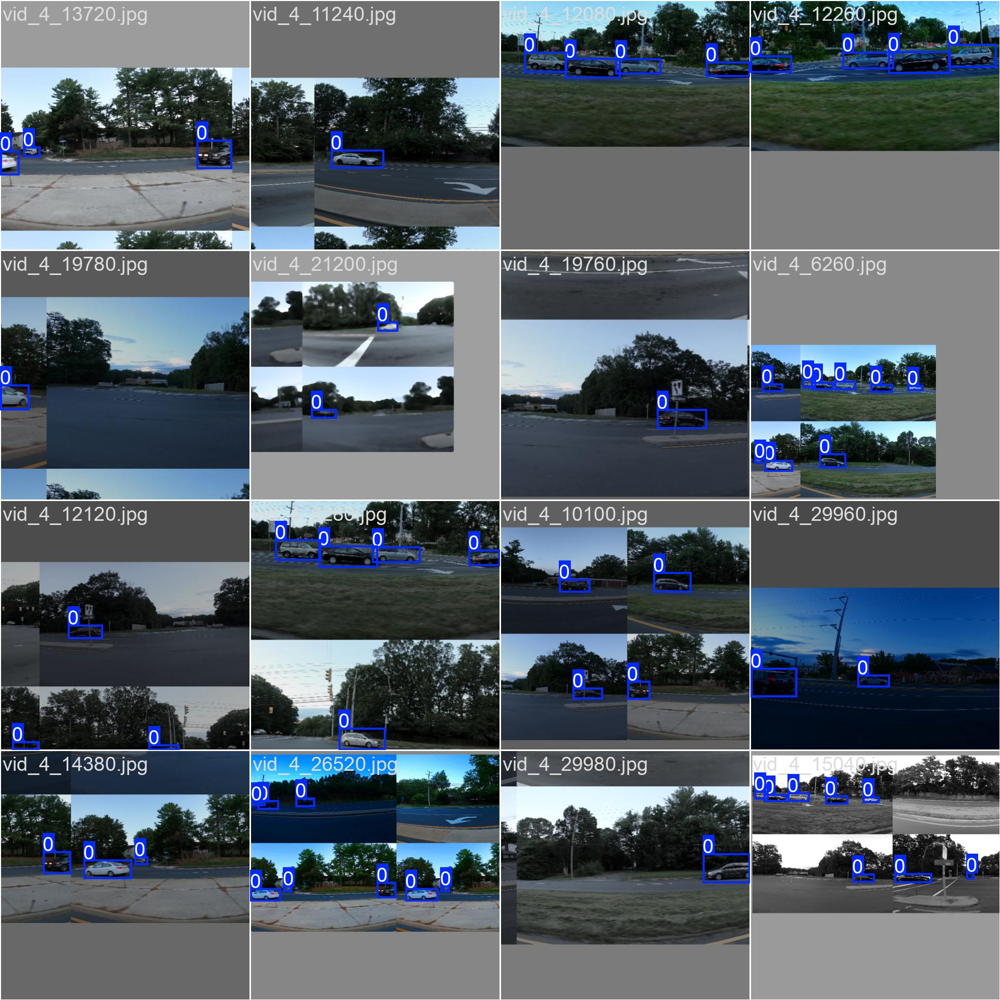

# Задача детекции автомобилей на изображении
## Набор данных
Используется набор данных ["Car Object Detection"](https://www.kaggle.com/datasets/sshikamaru/car-object-detection/data) с платформы Kaggle.
<figure>
  
  <figcaption>Пример изображений из обучающей выборки.</figcaption>
</figure>

## Модель
Данное решение использует модель YOLO для детекции автомобилей на изображении. В папке `models` содержатся обученные нами модели `YOLO11n`, `YOLO11s`, `YOLO11m`, `YOLO11l`.
Ниже в таблице представлено качество обученных моделей на тестовой выборке.
|Модель|Количество слоев|Количество параметров|mAP50|mAP50-95|Время валидации (в секундах)|
|----------|----------|----------|----------|----------|----------|
| YOLO11n    | 238 | 2'582'347 | 0.978    | 0.692   | 1 |
| YOLO11s    | 238 | 9'413'187 | 0.978    | 0.687   | 3 |
| YOLO11m    | 303 | 20'030'803 | 0.992    | 0.712   | 7 |
| YOLO11l    | 464 | 25'280'083 | 0.977    | 0.702   | 10 |
<!-- | YOLO11s    | 0.978   | 0.687   |
| Row 3    | Cell 8   | Cell 9   |
 -->
